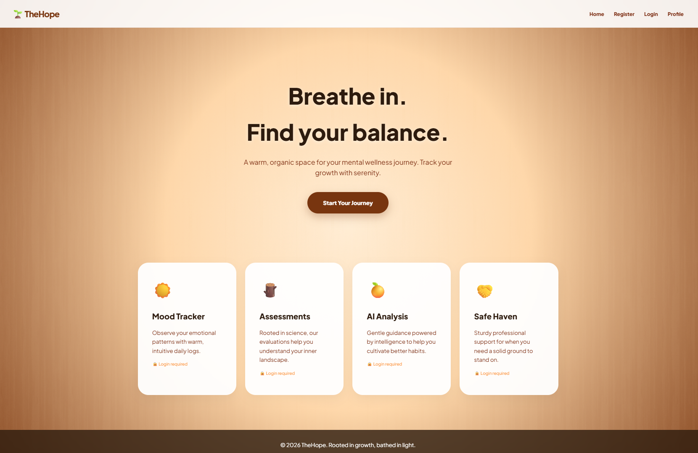
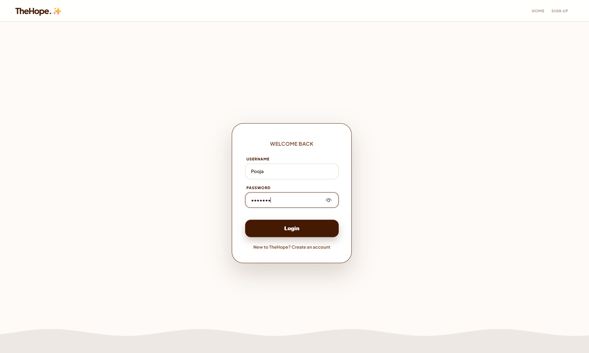
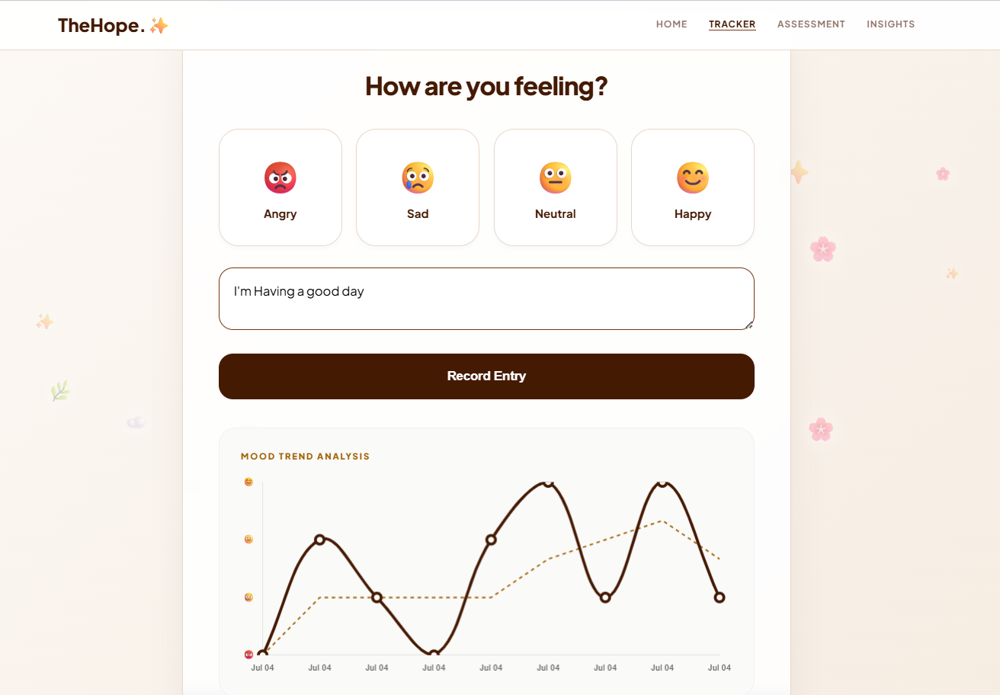
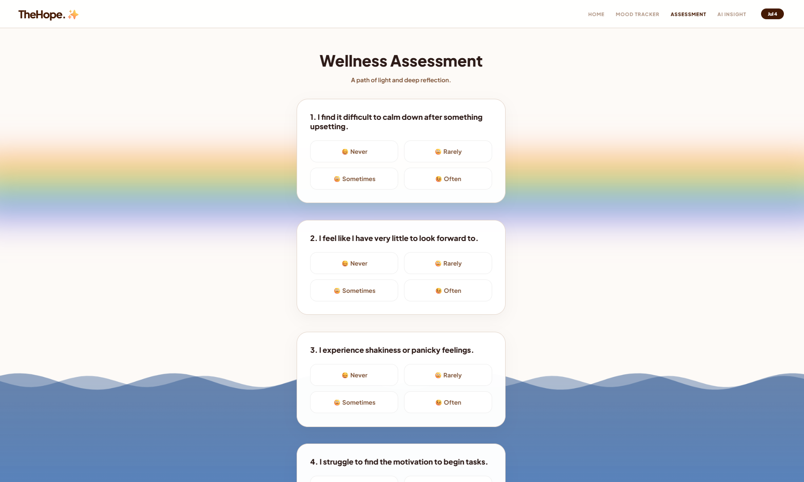
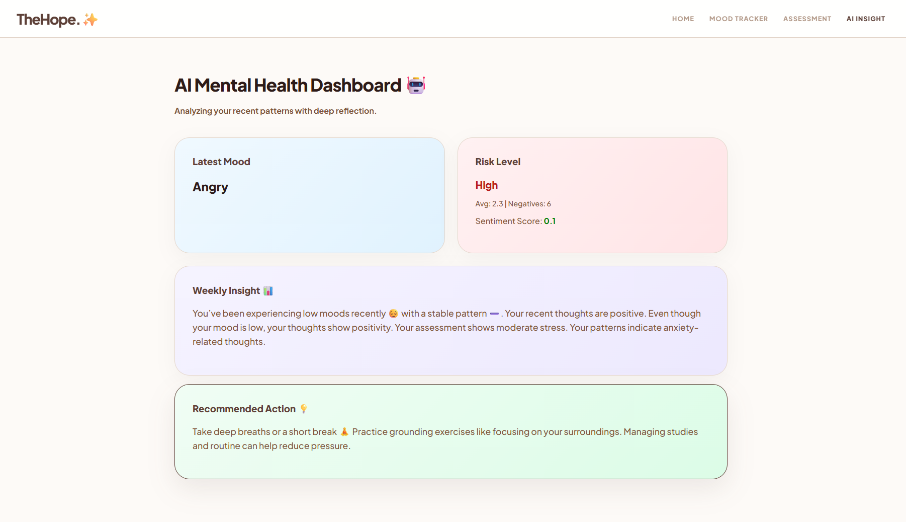
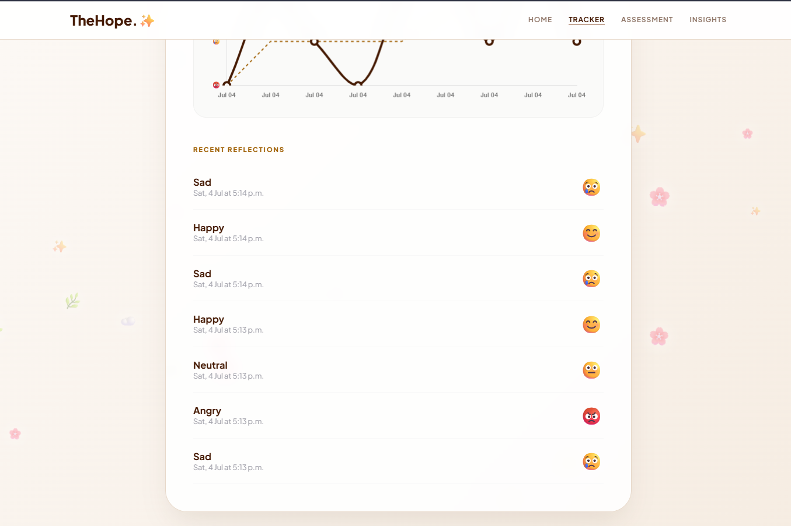
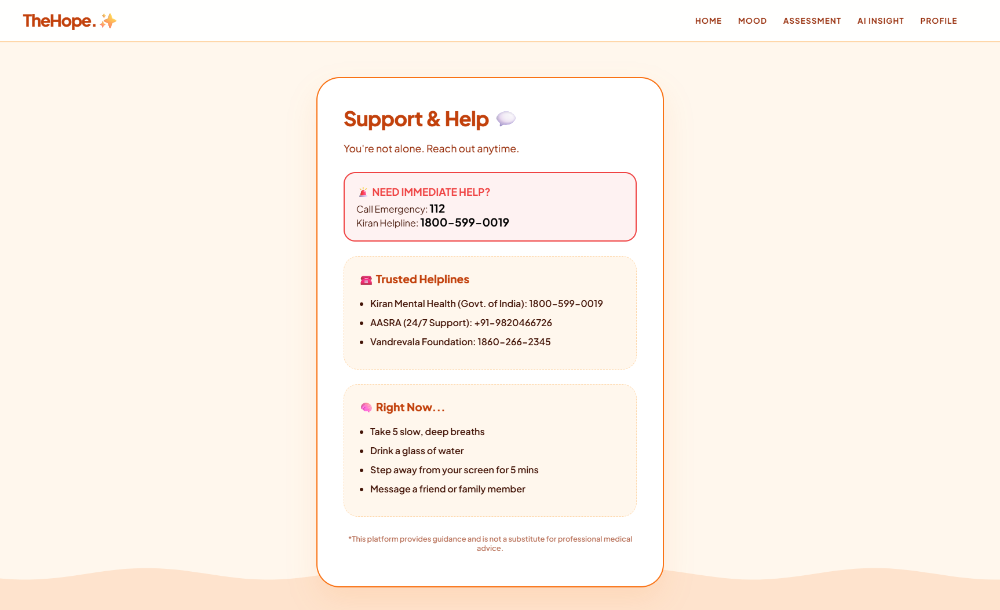

# 🧠 The Hope – AI-Powered Mental Health Support System


An AI-assisted Mental Health Support System developed using **Python**, **Django**, **SQLite**, and **Natural Language Processing (NLP)** to help users monitor their emotional well-being through mood tracking, self-assessment, sentiment analysis, and personalized wellness recommendations.

> **Disclaimer:** This project is developed for educational and portfolio purposes only. It is **not intended to replace professional medical or psychological advice, diagnosis, or treatment.**

---

# 📌 Project Overview

Mental health challenges such as stress, anxiety, and depression affect millions of people worldwide. Many individuals hesitate to seek professional support due to stigma, accessibility, or cost.

**The Hope** is a web-based application designed to provide users with a simple and secure platform to monitor their emotional well-being.

The system allows users to:

- 😊 Track daily moods
- 📝 Complete mental health self-assessments
- 💬 Analyze emotions using sentiment analysis
- 🤖 Receive AI-assisted mood insights
- 📈 Monitor emotional trends
- 💡 Get personalized wellness recommendations

The application follows Django's **Model–View–Template (MVT)** architecture and uses **Django ORM** for efficient and secure database management.

---

# 🌟 Key Highlights

- ✅ Secure User Authentication
- ✅ Daily Mood Tracking
- ✅ Mental Health Assessment
- ✅ AI-Assisted Mood Insights
- ✅ Sentiment Analysis using TextBlob & VADER
- ✅ Weekly Mood Trend Visualization
- ✅ Personalized Wellness Recommendations
- ✅ Responsive Web Interface
- ✅ Django MVT Architecture

---

# ✨ Features

## 🔐 User Authentication

- User Registration
- Secure Login
- Logout
- Password Hashing
- Session Management

---

## 😊 Mood Tracking

- Daily Mood Recording
- Mood History
- Weekly Mood Trends
- Mood Analytics Dashboard

---

## 📝 Mental Health Assessment

- Questionnaire-Based Assessment
- Rule-Based Risk Prediction
- Low / Moderate / High Risk Classification
- Assessment History

---

## 🤖 AI-Assisted Mood Insights

The AI insights module combines:

- Mood Records
- Assessment Results
- Sentiment Analysis
- Weekly Mood Trends

to generate:

- Emotional Risk Level
- Personalized Wellness Suggestions
- Weekly Mental Health Summary
- Self-Care Recommendations

---

## 💬 Sentiment Analysis

User mood notes are analyzed using:

- TextBlob
- VADER Sentiment Analyzer

The application classifies user emotions into:

- Positive
- Neutral
- Negative

---

## 📊 Dashboard & Visualization

- Weekly Mood Charts
- Mood History
- Average Mood Analysis
- Negative Mood Count
- Sentiment Summary
- Trend Visualization using Chart.js

---

## 👤 User Profile

- Personal Information
- Mental Health Preferences
- Personalized Recommendations

---

# 💼 Skills Demonstrated

- Python Programming
- Django Framework
- Backend Development
- Database Design
- Django ORM
- Authentication & Authorization
- Sentiment Analysis (NLP)
- Data Visualization
- Git & GitHub
- Problem Solving

---

# 🛠 Tech Stack

## Backend

- Python
- Django

## Frontend

- HTML5
- CSS3
- JavaScript
- Chart.js

## Database

- SQLite
- Django ORM

## AI & NLP

- TextBlob Sentiment Analysis
- VADER Sentiment Analysis
- Rule-Based Risk Prediction

## Development Tools

- Visual Studio Code
- Git
- GitHub

---

# 🏗 System Architecture

```
                  User
                    │
                    ▼
            Django URL Dispatcher
                    │
                    ▼
            Views (Business Logic)
              │               │
              ▼               ▼
          Templates        Models
                                │
                                ▼
                        SQLite Database
```

---

# 📂 Project Structure

```
AI-Mental-Health-Support-System/

│
├── core/
├── mood/
├── mental_assessment/
├── static/
├── templates/
├── thehope/
├── manage.py
├── requirements.txt
├── README.md
└── .gitignore
```

---

# 🚀 Installation

## Clone the Repository

```bash
git clone https://github.com/manishabangari57-ctrl/AI-Mental-Health-Support-System.git
```

Move into the project folder:

```bash
cd AI-Mental-Health-Support-System
```

Create a virtual environment:

```bash
python -m venv venv
```

Activate the virtual environment (Windows):

```bash
venv\Scripts\activate
```

Install required packages:

```bash
pip install -r requirements.txt
```

Apply database migrations:

```bash
python manage.py migrate
```

Run the development server:

```bash
python manage.py runserver
```

Open your browser and visit:

```
http://127.0.0.1:8000/
```

---

# 🌐 Live Demo

Currently available for local deployment.

Cloud deployment (Render/PythonAnywhere) will be added in future versions.

---

# 📸 Project Screenshots

## 🏠 Home Page



---

## 🔐 Login Page



---

## 😊 Mood Tracker



---

## 📝 Mental Health Assessment



---

## 🤖 AI Mood Insights



---

## 📈 Weekly Mood Dashboard



---

## 💬 Support Page



---

# 🔒 Security Features

- Secure User Authentication
- Password Hashing
- Session Management
- Django Forms Validation
- CSRF Protection
- Django ORM
- Input Validation

---

# 🚀 Future Enhancements

- AI Chatbot for Mental Health Support
- Email & SMS Notifications
- Mobile Application
- Cloud Deployment
- PostgreSQL Integration
- Doctor Appointment Scheduling
- Machine Learning-Based Risk Prediction
- Data Export & Reporting

---

# 🎓 Learning Outcomes

This project helped me strengthen my practical knowledge of:

- Django Web Development
- Python Programming
- Backend Development
- Database Management
- Authentication & Authorization
- Django ORM
- Natural Language Processing (TextBlob & VADER)
- Data Visualization
- Git & GitHub
- Software Architecture
- Problem Solving

---

# 📄 License

This project is licensed under the **MIT License**.

---

# 👩‍💻 Author

**Manisha Bangari**

🎓 MCA – Artificial Intelligence & Data Science

📧 Email: **manishabangari57@gmail.com**

🔗 GitHub: https://github.com/manishabangari57-ctrl

🔗 LinkedIn: *(Add your LinkedIn profile URL here)*

---

## ⭐ Support

If you found this project useful, consider giving it a ⭐ on GitHub.

Thank you for visiting!